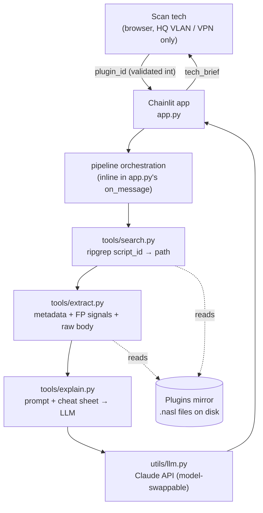
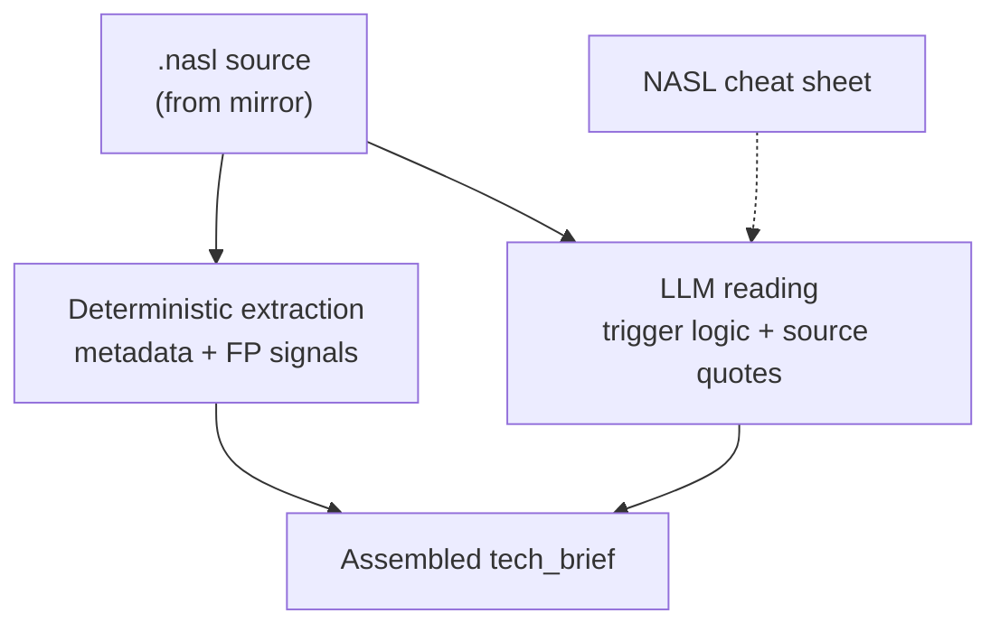

# AI Scan Assistant: Architecture

## Overview

The core realization that shapes this whole design: **the model reasoning is nearly
free, the value and the risk both live in the retrieval and extraction.** Any capable
model can read a NASL script and explain it. What's hard is reliably getting from a
plugin ID to the plugin's source and metadata, and turning that source into an
explanation a tech can trust while a customer is on the line.

So this is a tools project with a thin model call on top — **not** a tool-calling
agent. v1 is a fixed, linear pipeline (search → extract → explain) with exactly one
LLM step at the end. There's no agent loop, no MCP server, and nothing the model
"decides" to call: the flow is deterministic and the model only writes the final
explanation from data the pipeline already gathered.

## System layers



- **UI** — a Chainlit web app with a plain, ChatGPT-style chat box to keep adoption
  friction near zero. The tech opens a URL, types a plugin ID, reads the brief. It is
  a **separate app** from the existing internal scan interface (faster to ship,
  nothing to integrate). Access is restricted to the HQ Office VLAN / VPN, which is
  the access control — no auth layer in v1.
- **Pipeline** — the real work. A fixed sequence of plain synchronous Python
  functions: find the file, extract from it, explain it. Chainlit's handler runs this
  off the event loop with `cl.make_async`, so the backend itself stays synchronous.
- **Data** — a local mirror of the Nessus plugins directory. No live scanner
  connection, no Nessus API (see Environment).
- **Model** — reached through a one-function seam (`utils/llm.py`) so Claude or
  Gemini is a one-line swap. Nothing above it depends on the choice.

## Project structure

Actual layout (this is `uv`-managed — `pyproject.toml` / `uv.lock`, not
`requirements.txt`):

```
scan-agent/
├── app.py                # Chainlit entry point (on_message handler)
├── test.nasl             # real plugin (39465, CGI Generic Command Execution) kept
│                          # as a dev fixture — extract.py's __main__ runs against it
├── tools/
│   ├── search.py         # plugin_search(id) → path | None   (ripgrep) — id → path,
│   │                     # nothing else; extract.py owns everything past that
│   ├── extract.py        # extract(path) → dict {metadata, fp_signals, severity, body}
│   └── explain.py        # explain_plugin(data) → tech_brief, the LLM pass  [stub]
├── utils/
│   ├── nasl_patterns.py  # every regex + the STRING/unquote() string-literal helpers,
│   │                     # so tools/extract.py just applies patterns and shapes results
│   ├── llm.py            # Claude API seam (client init only so far)        [stub]
│   ├── build_index.py    # optional {id: path} index via grep, for a future
│   │                     # sub-millisecond lookup path; not currently wired in
│   └── cheatsheet.md     # NASL reference, meant to be injected into the prompt [empty]
├── plugins/
│   └── nessus.license    # only file checked in; the actual .nasl mirror is not
│                          # in the repo — see "Plugins mirror" below
├── docs/
│   └── ARCHITECTURE.md   # this file
├── .env                  # PLUGINS_DIR, ANTHROPIC_API_KEY, Nessus keys (git-ignored)
└── pyproject.toml         # chainlit, anthropic, dotenv
```

`main.py` is a leftover `uv init` template stub and isn't part of the app. There is no
`pipeline.py` yet — `search → extract → explain` orchestration is still to be written
(currently `app.py` doesn't call any of `tools/` yet either). `evals/known_plugins/`
doesn't exist yet; see "Open questions / next steps."

Target data flow once wired up: the tech types `39465` → `app.py` validates it's an
int → orchestration calls `tools/search.py` (id → path), `tools/extract.py`
(path → dict), and `tools/explain.py` (dict → brief, via `utils/llm.py` +
`utils/cheatsheet.md`) → `app.py` sends the brief back.

This is a fixed pipeline, not a tool-calling agent — `app.py` calls these functions
directly in a set order. "Tools" here just names the `tools/` directory; the model
never chooses whether or how to call `search`/`extract`, and that's deliberate (see
"Design decisions & rationale" below).

## Implementation status

Kept here (rather than only in `CLAUDE.md`) so it stays next to the design it tracks.

| Piece | Status |
|---|---|
| `tools/search.py` | Implemented: `plugin_search(id)` only — id → path, nothing else |
| `tools/extract.py` | Implemented: metadata, FP signals, severity — see "The explanation engine" |
| `utils/nasl_patterns.py` | Implemented: all regex patterns `tools/extract.py` applies |
| `tools/explain.py` | Implemented: `build_prompt()` assembles extract() output + the cheat sheet; `explain_plugin()` calls `utils/llm.py` and returns the tech brief text |
| `utils/llm.py` | Implemented: `respond(prompt)` seam — model defaults to `claude-sonnet-5` (`ANTHROPIC_LLM_MODEL` overrides), handles the `refusal` stop reason explicitly |
| `utils/build_index.py` | Implemented, optional, not wired into the app |
| `utils/cheatsheet.md` | Implemented — NASL cheat sheet content, injected into every prompt |
| `app.py` | Wired end to end: `search → extract → explain` → sends the model's tech brief. No separate `pipeline.py` — orchestration is inline in `app.py`'s message handler. |
| Pipeline orchestration | Inline in `app.py`, all three steps |
| `evals/known_plugins/` | Not created yet |
| Plugins mirror | Deliberately not in the repo (see below) |

## Pipeline components

### tools/search.py — locate the plugin

`.nasl` source exists only as files on the scanner; there is no API for it. The
lookup greps the mirror for `script_id(<plugin_id>)` — the same method techs use by
hand — rather than a raw substring, so it doesn't match dependencies or unrelated
plugins whose text happens to contain the number.

The directory holds ~309,377 files, so tool choice matters: plain `grep` takes 30+
seconds, **ripgrep takes 0–5s** (`sudo apt install ripgrep`). ripgrep is the v1
search. `utils/build_index.py` (a one-pass `{id: path}` map, rebuilt on plugin sync)
is available if sub-millisecond lookups are ever needed, but at ripgrep's speed it's
optional for v1.

Search is scoped to `.nasl` only. A miss (no `.nasl` match) is treated as "not
supported in v1" — see `.nbin` below. `plugin_search()` returns `None` only for a
genuine "no plugin has that ID" miss (ripgrep exit code 1); anything else (missing
`PLUGINS_DIR`, `rg` not installed, permissions) raises instead of silently looking
like a miss — a tech mid-call shouldn't see "not found" for a broken environment.

### tools/extract.py — the deterministic pass

Splits the file on the description block (tolerant of spacing — `exit ( 0 ) ;` still
splits correctly) into `header` (metadata) and `body` (runtime logic), then pulls with
regex the things that must be right and are mechanically extractable, never trusting
the model with anything it can extract itself. The regexes themselves live in
`utils/nasl_patterns.py`; this file just applies them and shapes the result. See "The
explanation engine" for the fields and signals.

### tools/explain.py + utils/llm.py — the LLM pass

`tools/explain.py`'s `build_prompt()` assembles the prompt from `extract()`'s dict
(deterministic facts framed as ground truth, never to be regenerated) plus
`utils/cheatsheet.md`; `explain_plugin()` passes that to `utils/llm.py`'s `respond()`
seam and returns the tech brief text. `utils/llm.py` is the only file that knows
which provider/model is in use — currently Claude, defaulting to `claude-sonnet-5`
(override with `ANTHROPIC_LLM_MODEL`). It explicitly checks for the `refusal` stop
reason rather than blindly reading `response.content`: this app routinely explains
injection/exploit payloads (that's the whole point), which is exactly the kind of
content a model's cyber-safety classifiers can decline.

### NVD (supplementary)

CVE IDs are already present in the `.nasl`, so NVD is optional enrichment, not a
dependency. When used, it adds external CVE context for a finding; it is the only
outbound call in the system and is not on the critical path.

## The explanation engine

The heart of the tool: turn a raw `.nasl` into a trustworthy, plain-language brief.
Guiding principle: **separate the facts that must be right and are mechanically
extractable from the one part that needs real reading.**



### Deterministic pass (must-be-right, mechanical)

NASL syntax is regular enough to parse with regex:

- **Liftable metadata** — `script_name`, `script_id`, `script_cve_id` / `script_xref`,
  and the `script_set_attribute` block, which carries Tenable's pre-written
  `synopsis`, `description`, `solution`, and `risk_factor`. That's a ready-made
  explanation and official remediation *already in the file* — lift it verbatim rather
  than generating it.
- **False-positive signals** — the reason this tool exists:
  - `if (report_paranoia < 2) audit(AUDIT_PARANOID)` — the check only runs in
    paranoid mode, i.e. Nessus itself flags it as false-positive-prone. Often the
    single most important thing to tell a customer. The comparison direction matters:
    `report_paranoia > 1` (seen in `torture_cgi_command_exec.nasl`, widening which OS
    payloads run) is a different use of the same variable and must not be read as
    this gate.
  - other `AUDIT_*` bailouts (e.g. `AUDIT_VER_NOT_GRANULAR`) — reasons a result is soft.
  - **banner vs. active** — the key discriminator. A check that reads a version off a
    header/KB and version-compares (`ver_compare`, `vcf::`, `check_version`) is a
    *banner check* (FP-prone on backported patches). A check that sends a payload and
    matches the response (`http_send_recv*`, `send(data:...)`) is an *active check*
    (reliable). This is a **best-effort** keyword match, not a guaranteed read: active
    checks that delegate through an include (e.g. `torture_cgi_command_exec.nasl`
    calling `torture_cgi_init()`/`torture_cgis()` from `torture_cgi.inc`) show neither
    keyword and correctly come back `unknown` rather than a wrong guess — that's the
    genuinely-needs-comprehension case the LLM pass exists for.
- **Severity** — `security_hole(...)` → high, `security_warning(...)` → medium,
  `security_note(...)` → low. Modern plugins built on `vcf::` helpers
  (`vcf::check_version_and_report(..., severity:SECURITY_HOLE)`) pass the same
  severity as an **uppercase constant, no call/parens** — both forms are matched. If
  neither appears, fall back to the `risk_factor` attribute rather than reporting no
  severity at all.

### LLM pass (needs comprehension)

The one part that genuinely requires reading: **what the plugin injects and what
response makes it fire.** This logic can be spread across variables, loops, and
includes (e.g. `torture_cgi_command_exec.nasl`'s `unix_flaws`/`win_flaws` arrays),
and it's where a model can be confidently wrong. Two cheap measures keep it
trustworthy on a live call:

- Feed the model the short **NASL cheat sheet** (below). NASL is niche — don't rely on
  training data for the idioms.
- Require it to **quote the exact source lines** it based the trigger explanation on
  (the payload string and the match condition). The tech can read code, so a verbatim
  excerpt lets them verify at a glance, and it structurally discourages the model from
  inventing a payload.

### Assembly

Deterministic facts frame the answer and are authoritative; the LLM fills the trigger
mechanism (held to the source) and writes the plain-language summary. The
false-positive signals — the actual purpose of the tool — come mostly from the
reliable deterministic side.

## Output contract

A single tech-facing brief. The tech reads it to understand the finding, relays the
plain-language part to the customer, and uses the trigger detail to hand-craft a
validation test themselves (auto-generated validation commands are a v2 feature).

```
tech_brief: {
  plugin_id,
  finding_name,
  severity,

  what_it_checks,   // plain-English: what the plugin looks for
  how_it_fires,     // the trigger, with quoted source lines (what it injects / matches)
  fp_analysis,      // why it may be a false positive / why it may have misfired
                    //   e.g. "only runs in paranoid mode -> Nessus flags it FP-prone;
                    //   matched reflected input, not confirmed execution"
  source_note,      // ".nasl — verified logic"  (v1 is .nasl-only)
  plain_summary     // jargon-free line the tech can relay to the customer
}
```

## NASL cheat sheet

A one-page reference (~40 lines) fed to the LLM pass. Small precisely because NASL is
regular — it teaches the niche idioms and points at where the good text already lives.
Meant to live in `utils/cheatsheet.md`, which is currently an empty stub — the content
below is the reference copy until it's moved there. Candidate for a dedicated skill
file later.

**1. Liftable metadata — where ready-made text lives**
- `script_name`, `script_id`, `script_cve_id`, `script_xref` — name and references
- `script_set_attribute(attribute:"synopsis"|"description"|"solution"|"risk_factor")`
  — pre-written vuln writeup, fix, and severity

**2. False-positive signals — the reason the tool exists**
- `report_paranoia` / `AUDIT_PARANOID` — runs only in paranoid mode; FP-prone
  (paranoia levels: 0 = avoid FPs, 1 = default, 2 = paranoid)
- other `AUDIT_*` bailouts — reasons a result is soft
- banner (version-compare off a header/KB) = FP-prone; active (payload + response
  match) = reliable

**3. Match operators / functions — misread if left to training data**
- `><` = contains, `>!<` = does not contain
- `=~` = regex match, `!~` = no match
- `egrep` / `ereg` / `eregmatch` = regex search on a string

**4. Severity + delivery — quick mappings**
- `security_hole` → high, `security_warning` → medium, `security_note` → low/info;
  `risk_factor` states it directly
- `get_http_port`, `http_get`, `http_keepalive_send_recv`, `http_send_recv3` — web
  check, and how it sends
- `set_kb_item` / `get_kb_item` — state passed between plugins (dependency gating)

## Design decisions & rationale

Captured so we don't relitigate them.

| Decision | Rationale |
|----------|-----------|
| Self-contained Chainlit web app, no MCP | Techs don't connect their own AI to it — it's an internal site they browse to. MCP is for exposing tools to an external client; that's the opposite of this. One app, one direct model call. |
| Chainlit UI, separate from the scan interface | ChatGPT-style chat box = near-zero adoption friction; standalone ships faster than integrating into the existing tool. |
| Access = HQ VLAN / VPN only | Network-level access control is sufficient for an internal tool; no auth layer needed in v1. |
| `plugin_id` is the only input | It's the unique key to everything in the brief. The only per-scan datum (host-specific output) is already on the tech's report page. |
| No scan ID / scan API in v1 | Standalone Nessus Professional has no analysis API; keeps the tool self-contained on the mirror. |
| `.nasl` only in v1; `.nbin` deferred | `.nbin` is compiled and can't be read (see below). Excluding it keeps search fast and the explanation honest. |
| No verdicts / routing / auto-resolve | Research assistant, not a triage engine. These findings are explained, not "resolved," and the tech is always the human. |
| Read-only; no agent-run commands | Auto-generating and firing payloads is attack tooling; even validation commands (v2) are output for the tech to run, never executed by the agent. |
| ripgrep over grep | 309k files: grep 30s+, ripgrep 0–5s. Same method, usable latency. |
| Parse-then-explain (deterministic + LLM) | Critical facts are mechanically extractable and must be right; only the trigger logic needs comprehension. Don't make the model do the parser's job. |
| Quote source lines in the trigger explanation | Turns "trust the AI" into "verify at a glance" for a code-literate tech, and discourages invented payloads. |
| Model-agnostic behind `utils/llm.py` | Avoids vendor lock-in and lets us evaluate models/providers/prompts against the eval set to catch drift or degradation. |
| Single `tech_brief` output | The tech is the one talking to the customer; one brief gives them the understanding plus a plain-language line to relay. No separate register to maintain. |

## `.nbin` handling (deferred to v2)

`.nbin` files are **compiled NASL** — Tenable's proprietary bytecode. The format is
undocumented and deliberately closed; there's no public decompiler, and
reverse-engineering it would be brittle and likely violates Tenable's license. **v1
does not support `.nbin`.** Search is `.nasl`-scoped, and a lookup that resolves to a
`.nbin` (or finds nothing) returns a clear "compiled plugin — not supported yet"
message rather than guessing.

Why it's not a dead end for v2: even compiled, a plugin keeps its human-facing
attributes as readable ASCII strings (name, synopsis, description, solution,
risk_factor, CVE), because Nessus has to display them. A future `.nbin` path is a
`strings`-style harvest of those fields plus NVD CVE data — which preserves the
customer-facing writeup but loses the *verified* trigger logic and the strongest FP
signals (paranoia gate, banner-vs-active), which live in the compiled control flow. A
second future avenue: `/opt/nessus/bin/nasl -t <target>:<port> <file>` can execute a
plugin, so running a `.nbin` against a controlled target with tracing would reveal its
runtime behavior — but that fires live payloads (active / "Mode B") and needs a
target, so it's firmly post-v1.

## Environment

- **Scanner:** standalone **Nessus Professional** (on the Tenable Core appliance),
  not Security Center — so plugin data comes from the local mirror, not a REST API.
- **Plugin directory:** `/opt/nessus/lib/nessus/plugins/` (~309,377 files).
- **Lookup:** ripgrep for `script_id(<plugin_id>)` in that directory.

### Plugins mirror — deliberately not in this repo

The mirror (`plugins.tar.gz`, manually downloaded 7/23/2026) is ~1GB compressed and
~309,377 files uncompressed — checking it into git isn't practical, so `.nasl`,
`*.tar.gz`, and `*.license` are all git-ignored (see `.gitignore`; the `plugins/`
directory here holds only `nessus.license`). This is intentional, not an oversight:
provisioning the mirror is a **deployment-time task**, not something needed while the
pipeline logic itself is being built. `PLUGINS_DIR` in `.env` just needs to point at
*some* local directory of `.nasl` files during development — it doesn't need to be
the full 309k-file mirror; a handful of representative plugins is enough to develop
and exercise `tools/search.py` / `tools/extract.py` / `tools/explain.py` against.

Two provisioning options are on the table for when deployment is actually being
figured out (not now):

1. Automate installing a free offline Nessus and pulling plugins via the Nessus CLI.
2. *Probably easier:* extract `plugins.tar.gz` directly into the plugins path.

Keeping the mirror in sync with source (rsync to the Enterprise scanner, or an API)
is out of scope for v1 regardless of which option is used.

## Open questions / next steps

The v1 pipeline (`search → extract → explain`, wired into `app.py`) is functionally
complete end to end. What's left:

- Build the **eval set** under `evals/known_plugins/` — verified plugin + expected
  explanation pairs. It's both the pre-launch trust gate and the ongoing
  drift/degradation check across models, providers, and prompt changes. Cover at
  least: a paranoid-mode plugin, a banner-only check, an active-injection check
  (e.g. `torture_cgi_command_exec`), and a not-supported `.nbin`.
- No retry/handling yet for the `RuntimeError` `explain_plugin()` raises on a model
  refusal beyond surfacing the message in the chat — worth revisiting once real usage
  shows how often it actually happens.
- **Deployment-time, not now:** provisioning the full plugins mirror in the sandbox
  (see above).
- **v2:** richer inputs (client/host/environment detail from Gravity); generated
  validation commands (curl / nmap / grep) output *with* per-command explanation and
  impact notes for the tech to run — never executed by the agent. Watch for the model
  refusing to emit validation commands on security grounds.